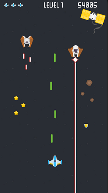

# Obligatorio 2 - Programación de Videojuegos - 2023

* Universidad ORT Uruguay
* Facultad de Ingeniería
* Docente: Ing. Ariel Coppes

## Objetivo

Implementar en Unity un videojuego de tipo Space Shooter 2D clásico. El objetivo es complementar y validar los conocimientos adquiridos durante el curso enfocando en experiencia, jugabilidad y mecánicas de juego que en definitiva influyen en la diversión.

Este género de juego tiene puntos en común con el género Endless Runner realizado para el primer obligatorio y del cual vamos a aprovechar los conocimientos adquiridos como base para este obligatorio.

El juego se plantea en un formato portrait en una resolución de 540x960 y se tiene que poder jugar en ventana y andar bien en esa resolución planteada. Los estudiantes son libres de soportar otros formatos en caso de querer.

Se presenta a continación un mockup para generar una idea de lo que se pretende.

Se espera una dedicación de 4 horas semanales por estudiante durante 8 semanas, lo cual equivale a 64hs por equipo (considerando un equipo de 2 personas). 

## Assets

Para realizar este obligatorio se van a utilizar una lista de assets del sitio http://kenney.nl de los packs de space shooter y ui.

Algunos assets ya se encuentran integrados en el proyecto base del obligatorio, de todas formas aquí se presenta la lista de los links donde descargar los assets:

* https://kenney.nl/assets/space-shooter-redux
* https://kenney.nl/assets/space-shooter-extension
* https://kenney.nl/assets/ui-audio
* https://kenney.nl/assets/digital-audio
* https://kenney.nl/assets/game-icons
* https://kenney.nl/assets/game-icons-expansion
* https://kenney.nl/assets/ui-pack
* https://kenney.nl/assets/ui-pack-space-expansion

## Requisitos

* Distintos tipos de enemigos, ejemplos:
  - Enemigo que dispara de lejos.
  - Enemigo que no dispara pero avanza haciendo algún patrón y hay que esquivarlo o matarlo antes que se acerque.
  - Secuencia de enemigos del tipo anterior.
  - Enemigo fijo en el nivel, por ejemplo asteroides que hay que romper o equivar.
  - Enemigo estructura estilo torreta que dispara pero está fijo en el fondo y queda para atrás ante el movimiento del jugador.
* Spawn de enemigos a lo largo del juego con algun criterio que refleje diseño de nivel e incremento en la dificultad.
* Se puede hacer endless el juego o bien se pueden diseñar niveles con secuencias de enemigos prefijadas, los alumnos deberán decidir que opción eligen.
* Uso de detección de colisiones de física de unity para hacer daño a enemigos y al jugador.
* Sistema de vida de enemigos y de jugador.
* Distintas armas que generen variantes visuales en el disparo, por ejemplo
  - Disparo directo hacia adelante
  - Disparo de varias bullets al mismo tiempo hacia adelante
  - Disparo de 3 bullets, una hacia adelante y otras dos en diagonal.
  - Misil teledirigido hacia enemigos.
* Pantalla de main menu, victory (en caso de pasar de niveles) y defeat, pantalla de créditos donde deberán poner la info de los estudiantes, materia, año, docente, y además agregar agradecimientos a los autores de los assets. 
* Sonidos
* Spawn de pickups para recuparar la vida, para cambiar de arma, para incrementar los puntos, etc.

Para lograr maximizar experiencia de juego se espera que se apliquen uno o más de los siguientes elementos:

* Camera shake (al recibir daño por ejemplo, o al eliminar un enemigo)
* Efectos de disparo, de impacto
* Sistemas de particulas para el propulsor de la nave, o para los misiles en caso de tener.
* Que las UI se sientan bien, respetar un tamaño común para las fonts, espaciado dentro de los botones, etc.
* Que haya elementos de decoración que se rompan cuando una bullet los toca o bien cuando algo explota cerca, etc (por ejemplo unas cajas).
* El movimiento de la cámara fluido y quizás permitir scrollear un poco para ambos lados.
* Parallax de elementos en el fondo.

Se espera que los estudiantes agreguen su impronta a la hora de crear comportamientos para los enemigos, distintas armas, efectos, etc, lo cual va a llevar a que cada equipo implemente el juego a su manera.

## Formato de entrega

Se espera subido al sistema de gestión un documento PDF con los siguientes datos:

* Nombre de estudiantes, materia, año, links para descargar una build windows. Link al repositorio github con el código del juego.

Opcionalmente se puede subir el juego a itch.io para simplificar su testeo y aumentar la distribución, en ese caso agregar también el link a itch en el PDF.

## Formato de evaluación

Utilizando el ejecutable o desde la página web, se va a probar la experiencia de juego, jugabilidad y diversión y luego se va a evaluar completitud de los requisitos planteados. No está demás aclarar que el juego tiene que estar funcionalmente correcto sin bugs que puedan afectar experiencia de juego.