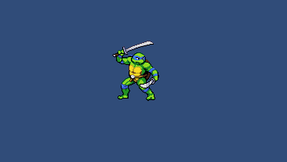

# Práctico Animaciones & Tweens (WORK IN PROGRESS)

## Objetivos

Poner en práctica los conocimientos de:

* Animaciones
  - General, Mechanim, eventos.
* Tweens
  - Corutinas, LeanTween, DotTween.

--- 

## Ejercicios

Crear un proyecto nuevo de Unity llamado `PracticoAnimaciones`. Como siempre, la recomendación es ir trabajando los ejercicios en escenas y estructuras de directorios separados por comodidad y prolijidad pero cada uno es libre de hacerlo como quiera..

### Ejercicio 1

Leonardo de las tortugas ninja vino a ayudarnos para este práctico, el primer ejercicio tenemos que hacerlo caminar de un lado para otro, asi que vamos a crear un controlador que cuando presionamos los controles izquierda y derecha Leonardo camina en esas direcciones y al soltar los controles se queda quieto. También es importante que apunte en la dirección que camina.

### Ejercicio 2

Vamos a hacer algo similar pero ahora nuestro personaje está compuesto con sprites y la animación construida en Mechanim (el sistema de animaciones de Unity) animando la escala del objeto a diferentes velocidades para el Idle y para el Walk.

---

## Bonus tracks

### Ejercicio 1.1

Ahora Leonardo realiza un ataque con la animación Attack al apretar la barra espaciadora, durante ese ataque no puede caminar en caso de tocar las teclas derecha o izquierda.

### Ejercicio 1.2

Ahora ene caso de hacer doble tap con la izquierda o derecha, Leonardo comienza a correr con la animación Sprint y se desplaza el doble de rápido, al soltar los controles ejecuta la animación SprintStop.

### Ejercicio 2.1

Al apretar la barra espaciadora nuestro personaje entra en un modo de carga con la animación Charge, si carga más de 1 segundo, al soltar la barra espaciadora el personaje hace una animacion de disparo Attack a mitad de la animación dispara un proyectil en la dirección que está mirando. Si suelta la barra espaciadora antes de la carga, vuelve a animacion Idle. 