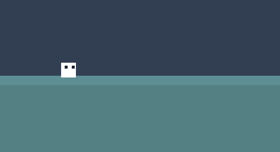

# Práctico Animaciones & Tweens (WORK IN PROGRESS)

## Objetivos

Poner en práctica los conocimientos de:

* Texturas, Sprites y Spritesheets
* Animaciones
  - Secuencia de imágenes
  - Mechanim
  - Blending de animaciones
* Tweens
  - Corutinas
  - LeanTween
* Sistema de partículas

--- 

## Ejercicios

Crear un proyecto nuevo de Unity llamado `PracticoAnimaciones`. Como siempre, la recomendación es ir trabajando los ejercicios en escenas y estructuras de directorios separados por comodidad y prolijidad pero cada uno es libre de hacerlo como quiera..

### Ejercicio 1

Leonardo de las tortugas ninja vino a ayudarnos para este práctico, el primer ejercicio tenemos que hacerlo caminar de un lado para otro, asi que vamos a crear un controlador que cuando presionamos los controles izquierda y derecha Leonardo camina en esas direcciones y al soltar los controles se queda quieto. También es importante que apunte en la dirección que camina.

### Ejercicio 2

Vamos a hacer algo similar pero ahora nuestro personaje está compuesto con sprites y la animación construida en Mechanim animando la escala del objeto a diferentes velocidades para el Idle y para el Walk.

---

## Bonus tracks

### Ejercicio 1.1

Ahora Leonardo realiza un ataque con la animación Attack al apretar la barra espaciadora, durante ese ataque no puede caminar en caso de tocar las teclas derecha o izquierda.

### Ejercicio 1.2

Ahora ene caso de hacer doble tap con la izquierda o derecha, Leonardo comienza a correr con la animación Sprint y se desplaza el doble de rápido, al soltar los controles ejecuta la animación SprintStop.

### Ejercicio 2.1

Al apretar la barra espaciadora nuestro personaje entra en un modo de carga con la animación Charge, si carga más de 1 segundo, al soltar la barra espaciadora el personaje hace una animacion de disparo Attack a mitad de la animación dispara un proyectil en la dirección que está mirando. Si suelta la barra espaciadora antes de la carga, vuelve a animacion Idle. 

## Referencias

* [Learn OpenGL Textures](https://learnopengl.com/Getting-started/Textures) - Artículo que explica más en detalle como funcionan las texturas en OpenGL pero que sirve a modo de ejemplo para entender algunos conceptos comunes entre distintas APIs gráficas.
* [Draw call batching](https://docs.unity3d.com/Manual/DrawCallBatching.html) - Documentación de Unity para entender como lograr batching.
* [Choosing the resolution of your 2D art assets](https://blog.unity.com/engine-platform/choosing-the-resolution-of-your-2d-art-assets) - Articulo que ayuda en la eleccion de tamaño de assets segun resolución objetivo y explica también pixel per units.
* [Cult of the Lamb - Spine showcase](https://www.youtube.com/watch?v=M4J6LAmsV7A) - Ejemplo animación por huesos en 2d usando Spine.
* [Art Design Deep Dive: Using a 3D pipeline for 2D animation in Dead Cells](https://www.gamedeveloper.com/production/art-design-deep-dive-using-a-3d-pipeline-for-2d-animation-in-i-dead-cells-i-) - Uso de pipeline 3d para generar animaciones 2d.