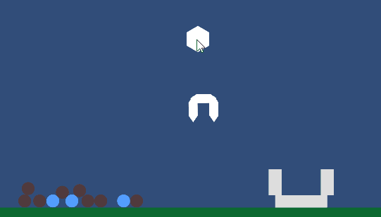

# Práctico Física Unity (WORK IN PROGRESS)

## Objetivos

Poner en práctica los conocimientos de:

* Detección de colisiones
  - Eventos de unity
  - API de Física (raycasts, overlap, etc)
  - Layers de colisiones
* Física de Unity
  - Definicion de cuerpos, aplicar fuerzas, etc.
  - Detección de contactos

--- 

## Ejercicios

Crear un proyecto nuevo de Unity llamado `PracticoFisicaUnity`. Como siempre, la recomendación es ir trabajando los ejercicios en escenas y estructuras de directorios separados por comodidad y prolijidad pero cada uno es libre de hacerlo como quiera..

### Ejercicio 1

Tenemos un cañon que dispara pelotas en un ángulo fijo cuando se presiona el boton izquierdo del mouse, y estas caen por la gravedad del motor de fisica en un contenedor. Es el comienzo de un juego de embocar pelotas.

### Ejercicio 2

Nuestro vehículo avanzado de recolección de basura metálica utiliza una tecnología de atracción magnética para identificar y recolectar elementos metálicos. 

Para construir el vehículo se puede usar dos objetos, el primero se mueve en la posicion del mouse, tiene un rigid body pero kinematico, el segundo, el magneto, no, se pueden unir por un joint. 

Para lograr el magneto se puede usar un physics overlap dado un radio o usando un CircleCollider2d, y a todos los elementos de un layer especifico aplicarles una fuerza de atracción en la dirección del magneto.

---

## Bonus tracks

### Ejercicio 1.3

Ahora el ángulo de disparo depende de dónde está ubicado el mouse, como si fuera la mira del cañon.

### Ejercicio 1.2

Si dejo apretado el boton del mouse carga el disparo y la pelota sale más cerca o más lejos según cuanto dejé apretado. Crear varios contenedores así el juego es a embocar en uno u otro.

### Ejercicio 1.3

Ahora el cañon dispara distintas formas y tamaños, no solo pelotas, puede disparar cajas, pelotas, hexágonos y triángulos.

### Ejercicio 1.4

Cada vez que el contenedor recibe un nuevo elemento se colorea temporalmente y vuelve a su color original. Cuando hay más de 4 elementos en un contenedor el contenedor se colorea de verde indicando que ese contenedor ya está lleno. Al llenar todos los contenedores el juego se termina mostrando un mensaje en pantalla de "VICTORY".

### Ejercicio 2.1

Mejorar el ejercicio 2 haciendo que los objetos que tocan el magneto pasan a estar unidos al magneto con un joint (dinámico) y se les deja de aplicar fuerza. Agregar un control que al mantener apretado el boton del mouse se deja de aplicar fuerzas y se liberan todos los joints de esos objetos, de manera de poder soltar a voluntad los elementos arriba del contenedor. 

### Ejercicio 2.2 

Crear elementos de distintas formas y tamaños, tanto elementos magnéticos como otros objetos no magnéticos. Al recolectar todos los elementos magnéticos en los contenedores, el juego termina mostrando en la pantalla un cartel que dice "VICTORY".